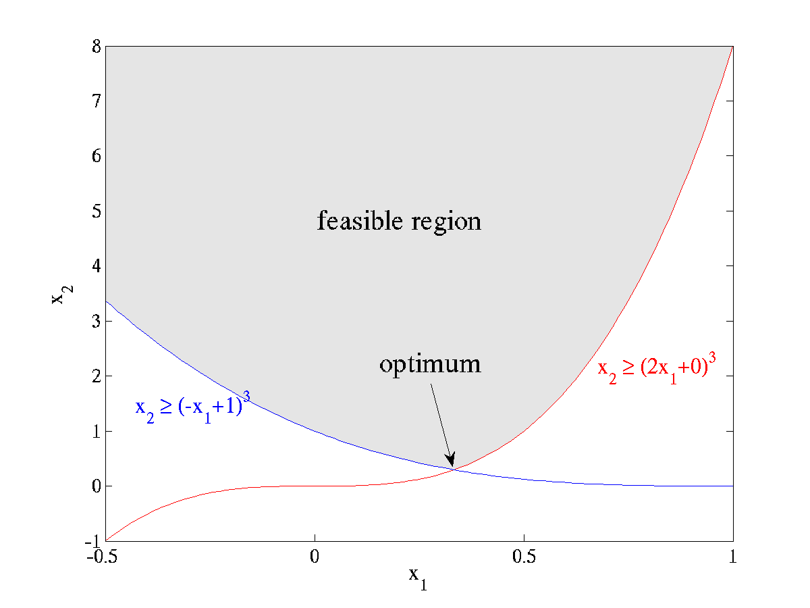

---
# NLopt Tutorial
---

In this tutorial, we illustrate the usage of NLopt in various languages via one or two trivial examples.

Example nonlinearly constrained problem
---------------------------------------




 As a first example, we'll look at the following simple nonlinearly constrained minimization problem:

$$\min_{\mathbf{x}\in\mathbb{R}^2} \sqrt{x_2}$$


subject to $x_2 \geq 0$, $x_2 \geq (a_1 x_1 + b_1)^3$, and $x_2 \geq (a_2 x_1 + b_2)^3$

for parameters *a*<sub>1</sub>=2, *b*<sub>1</sub>=0, *a*<sub>2</sub>=-1, *b*<sub>2</sub>=1.

The feasible region defined by these constraints is plotted at right: *x*<sub>2</sub> is constrained to lie above the maximum of two cubics, and the optimum point is located at the intersection (1/3, 8/27) where the objective function takes on the value $\sqrt{8/27} \approx 0.5443310539518\ldots$.

(This problem is especially trivial, because by formulating it in terms of the cube root of *x*<sub>2</sub> you can turn it into a linear-programming problem, but we won't do that here.)

In principle, we don't need the bound constraint *x*<sub>2</sub>≥0, since the nonlinear constraints already imply a positive-*x*<sub>2</sub> feasible region. However, NLopt doesn't guarantee that, on the way to finding the optimum, it won't violate the nonlinear constraints at some intermediate steps, while it *does* guarantee that all intermediate steps will satisfy the bound constraints. So, we will explicitly impose *x*<sub>2</sub>≥0 in order to ensure that the √*x*<sub>2</sub> in our objective is real.

**Note:** The objective function here is not differentiable at *x*<sub>2</sub>=0. This doesn't cause problems in the examples below, but may cause problems with some other algorithms if they try to evaluate the gradient at *x*<sub>2</sub>=0 (e.g. I've seen it cause AUGLAG with a gradient-based solver to fail). To prevent this, you might want to use a small nonzero lower bound instead, e.g. *x*<sub>2</sub>≥10<sup>−6</sup>.

Example in C/C++
----------------

To implement the above example in C or C++, we would first do:

```c
#include <math.h>
#include <nlopt.h>
```

to include the NLopt header file as well as the standard math header file (needed for things like the `sqrt` function and the `HUGE_VAL` constant), then we would define our objective function as:

```c
double myfunc(unsigned n, const double *x, double *grad, void *my_func_data)
{
    if (grad) {
        grad[0] = 0.0;
        grad[1] = 0.5 / sqrt(x[1]);
    }
    return sqrt(x[1]);
}
```


There are several things to notice here. First, since this is C, our indices are zero-based, so we have `x[0]` and `x[1]` instead of *x*<sub>1</sub> and *x*<sub>2</sub>. The return value of our function is the objective $\sqrt{x_2}$. Also, if the parameter `grad` is not `NULL`, then we set `grad[0]` and `grad[1]` to the partial derivatives of our objective with respect to `x[0]` and `x[1]`. The gradient is only needed for [gradient-based algorithms](NLopt_Introduction#Gradient-based_versus_derivative-free_algorithms.md); if you use a derivative-free optimization algorithm, `grad` will always be `NULL` and you need never compute any derivatives. Finally, we have an extra parameter `my_func_data` that can be used to pass additional data to `myfunc`, but no additional data is needed here so that parameter is unused.

For the constraints, on the other hand, we *will* have additional data. Each constraint is parameterized by two numbers *a* and *b*, so we will declare a data structure to hold this information:

```c
typedef struct {
    double a, b;
} my_constraint_data;
```


Then, we implement our constraint function as follows.

```c
double myconstraint(unsigned n, const double *x, double *grad, void *data)
{
    my_constraint_data *d = (my_constraint_data *) data;
    double a = d->a, b = d->b;
    if (grad) {
        grad[0] = 3 * a * (a*x[0] + b) * (a*x[0] + b);
        grad[1] = -1.0;
    }
    return ((a*x[0] + b) * (a*x[0] + b) * (a*x[0] + b) - x[1]);
 }
```


The form of the constraint function is the same as that of the objective function. Here, the `data` parameter will actually be a pointer to `my_constraint_data` (because this is the type that we will pass to `nlopt_minimize_constrained` below), so we use a typecast to get the constraint data. NLopt always expects constraints to be of the form `myconstraint`(**x**) ≤ 0, so we implement the constraint *x*<sub>2</sub> ≥ (*a* *x*<sub>1</sub> + *b*)<sup>3</sup> as the function (*a* *x*<sub>1</sub> + *b*)<sup>3</sup> − *x*<sub>2</sub>. Again, we only compute the gradient if `grad` is non-`NULL`, which will never occur if we use a derivative-free optimization algorithm.

Now, to specify this optimization problem, we create an "object" of type `nlopt_opt` (an opaque pointer type) and set its various parameters:

```c
double lb[2] = { -HUGE_VAL, 0 }; /* lower bounds */
nlopt_opt opt;
```


```c
opt = nlopt_create(NLOPT_LD_MMA, 2); /* algorithm and dimensionality */
nlopt_set_lower_bounds(opt, lb);
nlopt_set_min_objective(opt, myfunc, NULL);
```


Note that we do not need to set an upper bound (`nlopt_set_upper_bounds`), since we are happy with the default upper bounds (+∞). To add the two inequality constraints, we do:

```c
my_constraint_data data[2] = { {2,0}, {-1,1} };
```


```c
nlopt_add_inequality_constraint(opt, myconstraint, &data[0], 1e-8);
nlopt_add_inequality_constraint(opt, myconstraint, &data[1], 1e-8);
```


Here, the `1e-8` is an optional tolerance for the constraint: for purposes of convergence testing, a point will be considered feasible if the constraint is violated (is positive) by that tolerance (10<sup>−8</sup>). A nonzero tolerance is a good idea for many algorithms lest tiny errors prevent convergence. Speaking of convergence tests, we should also set one or more stopping criteria, e.g. a relative tolerance on the optimization parameters **x**:

```c
nlopt_set_xtol_rel(opt, 1e-4);
```


There are many more possible parameters that you can set to control the optimization, which are described in detail by the [reference manual](NLopt_Reference.md), but these are enough for our example here (any unspecified parameters are set to innocuous defaults). At this point, we can call nlopt_optimize to actually perform the optimization, starting with some initial guess:

```c
double x[2] = { 1.234, 5.678 };  /* `*`some` `initial` `guess`*` */
double minf; /* `*`the` `minimum` `objective` `value,` `upon` `return`*` */
if (nlopt_optimize(opt, x, &minf) < 0) {
    printf("nlopt failed!\n");
}
else {
    printf("found minimum at f(%g,%g) = %0.10g\n", x[0], x[1], minf);
}
```


`nlopt_optimize` will return a negative result code on failure, but this usually only happens if you pass invalid parameters, it runs out of memory, or something like that. (Actually, most of the other NLopt functions also return an error code that you can check if you are paranoid.) (However, if it returns the failure code `NLOPT_ROUNDOFF_LIMITED`, indicating a breakdown due to roundoff errors, the minimum found may still be useful and you may want to still use it.) Otherwise, we print out the minimum function value and the corresponding parameters **x**.

Finally, we should call nlopt_destroy to dispose of the `nlopt_opt` object when we are done with it:

```c
nlopt_destroy(opt);
```


Assuming we save this in a file tutorial.c, we would compile and link (on Unix) with:

```
cc tutorial.c -o tutorial -lnlopt -lm
```


The result of running the program should then be something like:

```
found minimum at f(0.333334,0.296296) = 0.544330847
```


That is, it found the correct parameters to about 5 significant digits and the correct minimum function value to about 6 significant digits. (This is better than we specified; this often occurs because the local optimization routines usually try to be conservative in estimating the error.)

### Number of evaluations

Let's modify our program to print out the number of function evaluations that were required to obtain this result. First, we'll change our objective function to:

```c
int count = 0;
double myfunc(int n, const double *x, double *grad, void *my_func_data)
{
    ++count;
    if (grad) {
        grad[0] = 0.0;
        grad[1] = 0.5 / sqrt(x[1]);
    }
    return sqrt(x[1]);
}
```


using a global variable `count` that is incremented for each function evaluation. (We could also pass a pointer to a counter variable as `my_func_data`, if we wanted to avoid global variables.) Then, adding a `printf`:

```c
printf("found minimum after %d evaluations\n", count);
```


we obtain:

```
found minimum after 11 evaluations
found minimum at f(0.333334,0.296296) = 0.544330847
```


For such a simple problem, a gradient-based local optimization algorithm like MMA can converge very quickly!

### Switching to a derivative-free algorithm

We can also try a derivative-free algorithm. Looking at the [NLopt Algorithms](NLopt_Algorithms.md) list, another algorithm in NLopt that handles nonlinear constraints is COBYLA, which is derivative-free. To use it, we just change `NLOPT_LD_MMA` ("LD" means local optimization, derivative/gradient-based) into `NLOPT_LN_COBYLA` ("LN" means local optimization, no derivatives), and obtain:

```
found minimum after 31 evaluations
found minimum at f(0.333329,0.2962) = 0.544242301
```


In such a low-dimensional problem, derivative-free algorithms usually work quite well—in this case, it only triples the number of function evaluations. However, the comparison is not perfect because, for the same relative **x** tolerance of 10<sup>−4</sup>, COBYLA is a bit less conservative and only finds the solution to 3 significant digits.

To do a fairer comparison of the two algorithms, we could set the **x** tolerance to zero and ask how many function evaluations each one requires to get the correct answer to three decimal places. We can specify this by using the `stopval` termination criterion, which allows us to halt the process as soon as a feasible point attains an objective function value less than `stopval`. In this case, we would set `stopval` to $\sqrt(8/27)+10^{-3}$, replacing `nlopt_set_xtol_rel` with the statement:

```c
nlopt_set_stopval(opt, sqrt(8./27.)+1e-3);
```


corresponding to the last line of arguments to `nlopt_minimize_constrained` being `sqrt(8./27.)+1e-3,` `0.0,` `0.0,` `0.0,` `NULL,` `0,` `0.0`. If we do this, we find that COBYLA requires 25 evaluations while MMA requires 10.

The advantage of gradient-based algorithms over derivative-free algorithms typically grows for higher-dimensional problems. On the other hand, derivative-free algorithms are much easier to use because you don't need to worry about how to compute the gradient (which might be tricky if the function is very complicated).

Example in C++
--------------

Although it is perfectly possible to use the C interface from C++, many C++ programmers will find it more natural to use real C++ objects instead of opaque `nlopt_opt` pointers, `std::vector<double>` instead of arrays, and exceptions instead of error codes. NLopt provides a C++ header file `nlopt.hpp` that you can use for this purpose, which simply wraps a C++ object interface around the C interface above.

```cpp
#include <iomanip>
#include <iostream>
#include <vector>

#include <nlopt.hpp>
```

The equivalent of the above example would then be:

```cpp
nlopt::opt opt(nlopt::LD_MMA, 2);
std::vector<double> lb(2);
lb[0] = -HUGE_VAL; lb[1] = 0;
opt.set_lower_bounds(lb);
opt.set_min_objective(myfunc, NULL);
my_constraint_data data[2] = { {2,0}, {-1,1} };
opt.add_inequality_constraint(myconstraint, &data[0], 1e-8);
opt.add_inequality_constraint(myconstraint, &data[1], 1e-8);
opt.set_xtol_rel(1e-4);
std::vector<double> x(2);
x[0] = 1.234; x[1] = 5.678;
double minf;

try{
    nlopt::result result = opt.optimize(x, minf);
    std::cout << "found minimum at f(" << x[0] << "," << x[1] << ") = "
        << std::setprecision(10) << minf << std::endl;
}
catch(std::exception &e) {
    std::cout << "nlopt failed: " << e.what() << std::endl;
}
```


There is no need to deallocate the `opt` object; its destructor will do that for you once it goes out of scope. Also, there is no longer any need to check for error codes; the NLopt C++ functions will throw exceptions if there is an error, which you can `catch` normally.

Here, we are using the same objective and constraint functions as in C, taking `double*` array arguments. Alternatively, you can define objective and constraint functions to take `std::vector<double>` arguments if you prefer. (Using `std::vector<double>` in the objective/constraint imposes a slight overhead because NLopt must copy the `double*` data to a `std::vector<double>`, but this overhead is unlikely to be significant in most real applications.) That is, you would do:

```cpp
double myvfunc(const std::vector<double> &x, std::vector<double> &grad, void *my_func_data)
{
    if (!grad.empty()) {
        grad[0] = 0.0;
        grad[1] = 0.5 / sqrt(x[1]);
    }
    return sqrt(x[1]);
}
```


```cpp
double myvconstraint(const std::vector<double> &x, std::vector<double> &grad, void *data)
{
    my_constraint_data *d = reinterpret_cast<my_constraint_data*>(data);
    double a = d->a, b = d->b;
    if (!grad.empty()) {
        grad[0] = 3 * a * (a*x[0] + b) * (a*x[0] + b);
        grad[1] = -1.0;
    }
    return ((a*x[0] + b) * (a*x[0] + b) * (a*x[0] + b) - x[1]);
}
```


Notice that, instead of checking whether `grad` is `NULL`, we check whether it is empty. (The vector arguments, if non-empty, are guaranteed to be of the same size as the dimension of the problem that you specified.) We then specify these in the same way as before:

```cpp
opt.set_min_objective(myvfunc, NULL);
opt.add_inequality_constraint(myvconstraint, &data[0], 1e-8);
opt.add_inequality_constraint(myvconstraint, &data[1], 1e-8);
```


Note that the data pointers passed to these functions must remain valid (or rather, what they point to must remain valid) until you are done with `opt`. (It might have been nicer to use `shared_ptr`, but I don't like to rely on bleeding-edge language features.)

Instead of passing a separate data pointer, some users may wish to define a C++ [function object](https://en.wikipedia.org/wiki/Function_object) class that contains all of the data needed by their function, with an overloaded `operator()` method to implement the function call. You can easily do this with a two-line helper function. If your function class is MyFunction, then you could define a static member function:

```cpp
static double wrap(const std::vector`<double>` &x, std::vector`<double>` &grad, void *data) {
    return (*reinterpret_cast`<MyFunction*>`(data))(x, grad); }
```


which you would then use e.g. by `opt.set_min_objective(MyFunction::wrap, &some_MyFunction)`. Again, you have to make sure that `some_MyFunction` does not go out of scope before you are done calling `nlopt::opt::optimize`.

To link your program, just link to the C NLopt library (`-lnlopt` `-lm` on Unix).

Example in Matlab or GNU Octave
-------------------------------

To implement this objective function in Matlab (or GNU Octave), we would write a file myfunc.m that looks like:

```matlab
function [val, gradient] = myfunc(x)
    val = sqrt(x(2));
    if (nargout > 1)
        gradient = [0, 0.5 / val];
    end
```


Notice that we check the Matlab builtin variable `nargout` (the number of output arguments) to decide whether to compute the gradient. If we use a derivative-free optimization algorithm below, then `nargout` will always be 1 and the gradient need never be computed.

Our constraint function looks similar, except that it is parameterized by the coefficients *a* and *b*. We can just add these on as extra parameters, in a file `myconstraint.m`:

```matlab
function [val, gradient] = myconstraint(x,a,b)
    val = (a*x(1) + b)^3 - x(2);
    if (nargout > 1)
        gradient = [3*a*(a*x(1) + b)^2, -1];
    end
```


The equivalent of the `nlopt_opt` is just a [structure](http://www.mathworks.com/access/helpdesk/help/techdoc/matlab_prog/f2-88951.html), with fields corresponding to any parameters that we want to set. (Any structure fields that we don't include are equivalent to not setting those parameters, and using the defaults instead). You can get more information on the available parameters by typing `help` `nlopt_optimize` in Matlab. The equivalent of the C example above is to define an `opt` structure by:

```matlab
opt.algorithm = NLOPT_LD_MMA
opt.lower_bounds = [-inf, 0]
opt.min_objective = @myfunc
opt.fc = { (@(x) myconstraint(x,2,0)), (@(x) myconstraint(x,-1,1)) }
opt.fc_tol = [1e-8, 1e-8];
opt.xtol_rel = 1e-4
```


We do not need to specify the dimension of the problem; this is implicitly specified by the size of the initial-guess vector passed to `nlopt_optimize` below (and must match the sizes of other vectors like `opt.lower_bounds`). The inequality constraints are specified as a [cell array](http://blogs.mathworks.com/loren/2006/06/21/cell-arrays-and-their-contents/) `opt.fc` of function handles (and the corresponding tolerances are in an array `opt.fc_tol`); notice how we use `@(x)` to define an anonymous/inline function in order to pass additional arguments to `myconstraint`.

Finally, we call `nlopt_optimize`:

```matlab
[xopt, fmin, retcode] = nlopt_optimize(opt, [1.234 5.678])
```


`nlopt_optimize` returns three things: `xopt`, the optimal parameters found; `fmin`, the corresponding value of the objective function, and a return code `retcode` (positive on success and negative on failure).

The output of the above command is:

```
xopt =
 0.3333  0.2963
fmin = 0.5443
retcode = 4
```


(The [return code](NLopt_Reference#Return_values.md) `4` corresponds to `NLOPT_XTOL_REACHED`, which means it converged to the specified *x* tolerance.) To switch to a derivative-free algorithm like COBYLA, we just change `opt.algorithm` parameter:

```matlab
opt.algorithm = NLOPT_LN_COBYLA
```


### Matlab verbose output

It is often useful to print out some status message to see what is happening, especially if your function evaluation is much slower or if a large number of evaluations are required (e.g. for global optimization). You can, of course, modify your function to print out whatever you want. As a shortcut, however, you can set a verbose option in NLopt's Matlab interface by:

```matlab
opt.verbose = 1;
```


If we do this, then running the MMA algorithm as above yields:

```matlab
nlopt_minimize_constrained eval #1: 2.38286
nlopt_minimize_constrained eval #2: 2.35613
nlopt_minimize_constrained eval #3: 2.24586
nlopt_minimize_constrained eval #4: 2.0191
nlopt_minimize_constrained eval #5: 1.74093
nlopt_minimize_constrained eval #6: 1.40421
nlopt_minimize_constrained eval #7: 1.0223
nlopt_minimize_constrained eval #8: 0.685203
nlopt_minimize_constrained eval #9: 0.552985
nlopt_minimize_constrained eval #10: 0.544354
nlopt_minimize_constrained eval #11: 0.544331
```


This shows the objective function values at each intermediate step of the optimization. As in the C example above, it converges in 11 steps. The COBYLA algorithm requires a few more iterations, because it doesn't exploit the gradient information:

```matlab
nlopt_optimize eval #1: 2.38286
nlopt_optimize eval #2: 2.38286
nlopt_optimize eval #3: 3.15222
nlopt_optimize eval #4: 1.20627
nlopt_optimize eval #5: 0.499441
nlopt_optimize eval #6: 0.709216
nlopt_optimize eval #7: 0.20341
nlopt_optimize eval #8: 0.745201
nlopt_optimize eval #9: 0.989693
nlopt_optimize eval #10: 0.324679
nlopt_optimize eval #11: 0.804318
nlopt_optimize eval #12: 0.541431
nlopt_optimize eval #13: 0.561137
nlopt_optimize eval #14: 0.531346
nlopt_optimize eval #15: 0.515784
nlopt_optimize eval #16: 0.541724
nlopt_optimize eval #17: 0.541422
nlopt_optimize eval #18: 0.541504
nlopt_optimize eval #19: 0.541499
nlopt_optimize eval #20: 0.541514
nlopt_optimize eval #21: 0.541352
nlopt_optimize eval #22: 0.542089
nlopt_optimize eval #23: 0.542575
nlopt_optimize eval #24: 0.543027
nlopt_optimize eval #25: 0.544911
nlopt_optimize eval #26: 0.541793
nlopt_optimize eval #27: 0.545225
nlopt_optimize eval #28: 0.544331
nlopt_optimize eval #29: 0.544256
nlopt_optimize eval #30: 0.544242
nlopt_optimize eval #31: 0.544116
```


Notice that some of the objective function values are below the minimum of 0.54433 — these are simply values of the objective function at infeasible points (violating the nonlinear constraints).

Example in Python
-----------------

The same example in Python is:

```python
import nlopt
from numpy import *
def myfunc(x, grad):
    if grad.size > 0:
        grad[0] = 0.0
        grad[1] = 0.5 / sqrt(x[1])
    return sqrt(x[1])
def myconstraint(x, grad, a, b):
    if grad.size > 0:
        grad[0] = 3 * a * (a*x[0] + b)**2
        grad[1] = -1.0
    return (a*x[0] + b)**3 - x[1]
opt = nlopt.opt(nlopt.LD_MMA, 2)
opt.set_lower_bounds([-float('inf'), 0])
opt.set_min_objective(myfunc)
opt.add_inequality_constraint(lambda x,grad: myconstraint(x,grad,2,0), 1e-8)
opt.add_inequality_constraint(lambda x,grad: myconstraint(x,grad,-1,1), 1e-8)
opt.set_xtol_rel(1e-4)
x = opt.optimize([1.234, 5.678])
minf = opt.last_optimum_value()
print("optimum at ", x[0], x[1])
print("minimum value = ", minf)
print("result code = ", opt.last_optimize_result())
```


Notice that the `optimize` method returns only the location of the optimum (as a NumPy array), and that the value of the optimum and the result code are obtained by `last_optimum_value` and `last_optimize_result` values. Like in C++, the NLopt functions raise exceptions on errors, so we don't need to check return codes to look for errors.

The objective and constraint functions take NumPy arrays as arguments; if the `grad` argument is non-empty it must be modified *in-place* to the value of the gradient. Notice how we use Python's `lambda` construct to pass additional parameters to the constraints. Alternatively, we could define the objective/constraints as classes with a `__call__(self,` `x,` `grad)` method so that they can behave like functions.

The result of running the above code should be:

```python
optimum at  0.333333331366 0.296296292697
minimum value =  0.544331050646
result =  4
```


finding the same correct optimum as in the C interface (of course). (The [return code](NLopt_Reference#Return_values.md) `4` corresponds to `nlopt.XTOL_REACHED`, which means it converged to the specified *x* tolerance.)

### Important: Modifying `grad` in-place

The grad argument of your objective/constraint functions must be modified *in-place*. If you use an operation like

```python
grad = 2*x
```


however, Python allocates a new array to hold `2*x` and reassigns grad to point to it, rather than modifying the original contents of grad. **This will not work.** Instead, you should do:

```python
grad[:] = 2*x
```


which *overwrites* the old contents of grad with `2*x`. See also the [NLopt Python Reference](NLopt_Python_Reference#Assigning_results_in-place.md).

Example in GNU Guile (Scheme)
-----------------------------

In [GNU Guile](https://en.wikipedia.org/wiki/GNU_Guile), which is an implementation of the [Scheme programming language](https://en.wikipedia.org/wiki/Scheme_(programming_language)), the equivalent of the example above would be:

```guile
(use-modules (nlopt))
(define (myfunc x grad)
  (if grad
      (begin
        (vector-set! grad 0 0.0)
        (vector-set! grad 1 (/ 0.5 (sqrt (vector-ref x 1))))))
  (sqrt (vector-ref x 1)))
(define (myconstraint x grad a b)
  (let ((x0 (vector-ref x 0)) (x1 (vector-ref x 1)))
    (if grad
        (begin
          (vector-set! grad 0 (* 3 a (expt (+ (* a x0) b) 2)))
          (vector-set! grad 1 -1.0)))
    (- (expt (+ (* a x0) b) 3) x1)))
(define opt (new-nlopt-opt NLOPT-LD-MMA 2))
(nlopt-opt-set-lower-bounds opt (vector (- (inf)) 0))
(nlopt-opt-set-min-objective opt myfunc)
(nlopt-opt-add-inequality-constraint opt (lambda (x grad)
                                           (myconstraint x grad 2 0))
                                     1e-8)
(nlopt-opt-add-inequality-constraint opt (lambda (x grad)
                                           (myconstraint x grad -1 1))
                                     1e-8)
(nlopt-opt-set-xtol-rel opt 1e-4)
(define x (nlopt-opt-optimize opt (vector 1.234 5.678)))
(define minf (nlopt-opt-last-optimum-value opt))
(define result (nlopt-opt-last-optimize-result opt))
```


Note that the objective/constraint functions take two arguments, `x` and `grad`, and return a number. `x` is a vector whose length is the dimension of the problem; grad is either false (`#f`) if it is not needed, or a `vector` that must be modified *in-place* to the gradient of the function.

On error conditions, the NLopt functions throw [exceptions](http://www.gnu.org/software/guile/manual/html_node/Exceptions.html) that can be caught by your Scheme code if you wish.

The heavy use of side-effects here is a bit unnatural in Scheme, but is used in order to closely map to the C++ interface. (Notice that `nlopt::` C++ functions map to `nlopt-` Guile functions, and `nlopt::opt::` methods map to `nlopt-opt-` functions that take the `opt` object as the first argument.) Of course, you are free to wrap your own Scheme-like functional interface around this if you wish.

Example in Fortran
------------------

In [Fortran](https://en.wikipedia.org/wiki/Fortran), the equivalent of the C example above would be as follows. First, we would write our functions as:

```fortran
     subroutine myfunc(val, n, x, grad, need_gradient, f_data)
     double precision val, x(n), grad(n)
     integer n, need_gradient
     if (need_gradient.ne.0) then
        grad(1) = 0.0
        grad(2) = 0.5 / dsqrt(x(2))
     endif
     val = dsqrt(x(2))
     end
```


```fortran
     subroutine myconstraint(val, n, x, grad, need_gradient, d)
     integer need_gradient
     double precision val, x(n), grad(n), d(2), a, b
     a = d(1)
     b = d(2)
     if (need_gradient.ne.0) then
        grad(1) = 3. * a * (a*x(1) + b)**2
        grad(2) = -1.0
     endif
     val = (a*x(1) + b)**3 - x(2)
     end
```


Notice that that the "functions" are actually subroutines. This is because it turns out to be hard to call Fortran functions from C or vice versa in any remotely portable way. Therefore:

-   In the NLopt Fortran interface, all C functions become subroutines in Fortran, with the return value becoming the first argument.

So, here the first argument `val` is used for the return value. Also, because there is no way in Fortran to pass `NULL` for the `grad` argument, we add an additional `need_gradient` argument which is nonzero if the gradient needs to be computed. Finally, the last argument is the equivalent of the `void*` argument in the C API, and can be used to pass a single argument of any type through to the objective/constraint functions: here, we use it in `myconstraint` to pass an array of two values for the constants *a* and *b*.

Then, to run the optimization, we can use the following Fortran program:

```fortran
     program main
     external myfunc, myconstraint
     double precision lb(2)
     integer*8 opt
     double precision d1(2), d2(2)
     double precision x(2), minf
     integer ires
     include 'nlopt.f'
     
     call nlo_create(opt, NLOPT_LD_MMA, 2)
     call nlo_get_lower_bounds(ires, opt, lb)
     lb(2) = 0.0
     call nlo_set_lower_bounds(ires, opt, lb)
     call nlo_set_min_objective(ires, opt, myfunc, 0)
     
     d1(1) = 2.
     d1(2) = 0.
     call nlo_add_inequality_constraint(ires, opt, 
    $     myconstraint, d1, 1.D-8)
     d2(1) = -1.
     d2(2) = 1.
     call nlo_add_inequality_constraint(ires, opt,
    $     myconstraint, d2, 1.D-8)
     
     call nlo_set_xtol_rel(ires, opt, 1.D-4)
     
     x(1) = 1.234
     x(2) = 5.678
     call nlo_optimize(ires, opt, x, minf)
     if (ires.lt.0) then
        write(*,*) 'nlopt failed!'
     else
        write(*,*) 'found min at ', x(1), x(2)
        write(*,*) 'min val = ', minf
     endif
     
     call nlo_destroy(opt)
     
     end
```


There are a few things to note here:

-   All `nlopt_` functions are converted into `nlo_` subroutines, with return values converted into the first argument.
-   The "`nlopt_opt`" variable `opt` is declared as `integer*8`. (Technically, we could use any type that is big enough to hold a pointer on all platforms; `integer*8` is big enough for pointers on both 32-bit and 64-bit machines.)
-   The subroutines must be declared as `external`.
-   We `include` `'nlopt.f'` in order to get the various constants like `NLOPT_LD_MMA`.

There is no standard Fortran 77 equivalent of C's `HUGE_VAL` constant, so instead we just call `nlo_get_lower_bounds` to get the default lower bounds (-∞) and then change one of them. In Fortran 90 (and supported as an extension in many Fortran 77 compilers), there is a `huge` intrinsic function that we could have used instead:

```fortran
     lb(1) = -huge(lb(1))
```


Example in Julia
----------------

The same example in the [Julia programming language](https://en.wikipedia.org/wiki/Julia_(programming_language)) can be found at the [NLopt.jl](https://github.com/stevengj/NLopt.jl) web page.


