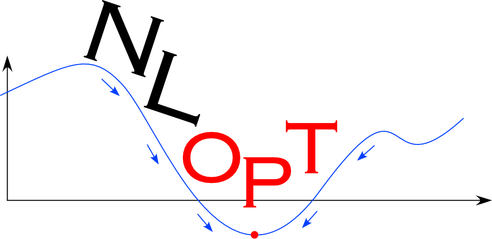

---
# NLopt
---




NLopt
-----

**NLopt** is a free/open-source library for **nonlinear optimization**, providing a common interface for a number of different free optimization routines available online as well as original implementations of various other algorithms. Its features include:

-   Callable from [C](NLopt_Reference.md), [C++](NLopt_C-plus-plus_Reference.md), [Fortran](NLopt_Fortran_Reference.md), [Matlab or GNU Octave](NLopt_Matlab_Reference.md), [Python](NLopt_Python_Reference.md), [GNU Guile](NLopt_Guile_Reference.md), [Julia](https://github.com/stevengj/NLopt.jl), [GNU R](NLopt_R_Reference.md), [Lua](https://github.com/rochus-keller/LuaNLopt), and [OCaml](https://bitbucket.org/mkur/nlopt-ocaml).
-   A common interface for [many different algorithms](NLopt_Algorithms.md)—try a different algorithm just by changing one parameter.
-   Support for large-scale optimization (some algorithms scalable to millions of parameters and thousands of constraints).
-   Both global and local optimization algorithms.
-   Algorithms using function values only (derivative-free) and also algorithms exploiting user-supplied gradients.
-   Algorithms for unconstrained optimization, bound-constrained optimization, and general nonlinear inequality/equality constraints.
-   Free/open-source software under the [GNU LGPL](https://en.wikipedia.org/wiki/GNU_Lesser_General_Public_License) (and looser licenses for some portions of NLopt).

See the [NLopt Introduction](NLopt_Introduction.md) for a further overview of the types of problems it addresses.

Download and installation
-------------------------

Version 2.4.2 of NLopt is the latest version available from our web site:

-   [nlopt-2.4.2.tar.gz](http://ab-initio.mit.edu/nlopt/nlopt-2.4.2.tar.gz)

See the [NLopt release notes](NLopt_release_notes.md) for the release history. NLopt is designed to be installed on any Unix-like system (GNU/Linux is fine) with a C compiler, using the standard

```
./configure && make && sudo make install
```


procedure. See the [NLopt Installation](NLopt_Installation.md) instructions for more information.

For Microsoft Windows, see [NLopt on Windows](NLopt_on_Windows.md) for more information and precompiled libraries.

For **developers**, the latest development sources can be found at [<https://github.com/stevengj/nlopt>](https://github.com/stevengj/nlopt).

Documentation and Mailing Lists
-------------------------------

See the [NLopt manual](NLopt_Introduction.md) for information on how to use NLopt and what optimization algorithms it includes.

Please [cite NLopt](Citing_NLopt.md) and the authors of the algorithm(s) you use in any publication that stems from your use of NLopt.

### Mailing Lists

The NLopt mailing lists (and their archives) are another source of information about NLopt.

Subscribe to the (read-only) [nlopt-announce mailing list](http://ab-initio.mit.edu/cgi-bin/mailman/listinfo/nlopt-announce) to receive an email when NLopt is updated in the future. Subscribe to the (unmoderated) [nlopt-discuss mailing list](http://ab-initio.mit.edu/cgi-bin/mailman/listinfo/nlopt-discuss) for discussion of questions and ideas about using NLopt.

As an alternative to the *nlopt-announce* mailing list, an [Atom newsfeed](https://en.wikipedia.org/wiki/Atom_(standard)) for NLopt releases is available from the [Freshmeat.net NLopt page](http://freshmeat.net/projects/nlopt).

Acknowledgements
----------------

We are grateful to the many authors who have published useful optimization algorithms implemented in NLopt, especially those who have provided free/open-source implementations of their algorithms.

*Please cite* these authors if you use their code or the implementation of their algorithm in NLopt. See the documentation for the appropriate citation for each of the [algorithms in NLopt](NLopt_Algorithms.md) — please see the [Citing NLopt](Citing_NLopt.md) information.

Contact and Feedback
--------------------

If you have questions or problems regarding NLopt, you are encouraged query the [nlopt-discuss mailing list](http://ab-initio.mit.edu/cgi-bin/mailman/listinfo/nlopt-discuss) (see above). As your first resort, please look at the [nlopt-discuss archives](http://ab-initio.mit.edu/pipermail/nlopt-discuss/).

Alternatively, you may directly contact [Steven G. Johnson](http://math.mit.edu/~stevenj) at <stevenj@alum.mit.edu>.

[—Steven G. Johnson](User:Stevenj.md) 18:13, 1 September 2008 (EDT)
